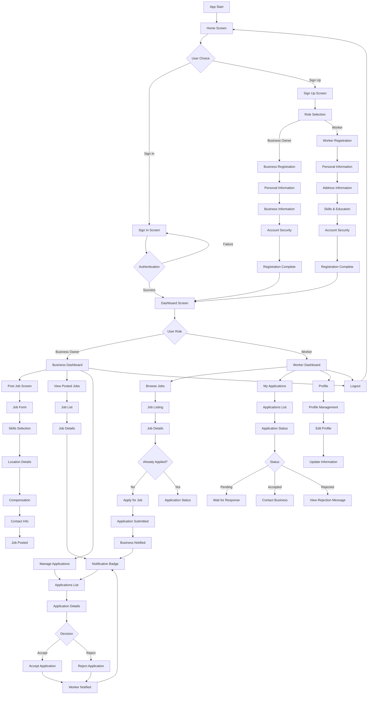

# WorkBee - Flow Chart Diagram

## App Flow Overview



## Detailed Workflow Descriptions

### 1. Authentication Flow
```
User Entry → Role Selection → Registration/Login → Dashboard
```

**Key Features:**
- Role-based registration with different forms
- Comprehensive validation
- Secure authentication
- Theme support (dark/light mode)

### 2. Business Owner Workflow
```
Dashboard → Post Job → Receive Applications → Review → Accept/Reject → Track Progress
```

**Job Posting Process:**
1. **Job Details**: Title, description, required skills
2. **Location**: Address, state, city, pin code
3. **Compensation**: Hourly rate, estimated hours
4. **Contact Info**: Person, phone, email
5. **Skills Selection**: Multi-select from predefined list

**Application Management:**
1. **View Applications**: List all applications for each job
2. **Review Profiles**: Worker details, skills, experience
3. **Make Decision**: Accept or reject with optional message
4. **Track Status**: Monitor job progress and completion

### 3. Worker Workflow
```
Dashboard → Browse Jobs → Apply → Track Applications → Receive Response → Contact Business
```

**Job Discovery:**
1. **Browse Jobs**: View all available jobs
2. **Filter Options**: By location, skills, compensation
3. **Job Details**: Complete information with business details
4. **Apply**: Submit application with profile data

**Application Tracking:**
1. **My Applications**: View all submitted applications
2. **Status Updates**: Real-time status changes
3. **Response Handling**: Accept/reject notifications
4. **Business Contact**: Reach out when accepted

### 4. Notification System
```
Event Trigger → Notification Badge → User Action → Status Update
```

**Notification Types:**
- New application received (Business)
- Application status changed (Worker)
- Job posted (Worker - if subscribed)
- Response received (Worker)

### 5. Data Flow
```
User Input → Validation → State Update → UI Refresh → API Call (Future)
```

**State Management:**
- Provider pattern for state management
- Real-time updates across screens
- Persistent data storage (ready for backend)
- Error handling and loading states

## 2024 Updates: Role-Based Dashboards & Command Operations
- Business owners and workers have distinct dashboard screens with tabbed navigation and notification badges.
- Job operations (posting, applying, responding, updating status) are handled via command pattern for better workflow management.
- Navigation is centralized and role-aware.

## Key Interactions

### Business Owner Interactions
1. **Post Job**: Create comprehensive job listings
2. **Manage Applications**: Review and respond to workers
3. **Track Jobs**: Monitor job status and completion
4. **View Statistics**: Dashboard with key metrics

### Worker Interactions
1. **Browse Jobs**: Discover available opportunities
2. **Apply**: Submit applications with profile
3. **Track Applications**: Monitor application status
4. **Manage Profile**: Update personal information

### System Interactions
1. **Real-time Updates**: Instant status changes
2. **Notification System**: Badge counts and alerts
3. **Data Synchronization**: Consistent state across screens
4. **Error Handling**: Graceful error management

## Success Metrics

### Business Owner Success
- Jobs posted successfully
- Applications received
- Response time to applications
- Job completion rate

### Worker Success
- Jobs applied to
- Application acceptance rate
- Response time from businesses
- Job completion rate

### Platform Success
- User engagement
- Job posting frequency
- Application success rate
- User satisfaction

## Future Enhancements

### Phase 2 Features
- Real-time messaging
- Push notifications
- Payment processing
- Rating system

### Phase 3 Features
- Advanced matching algorithms
- Video calling
- Document verification
- Analytics dashboard 