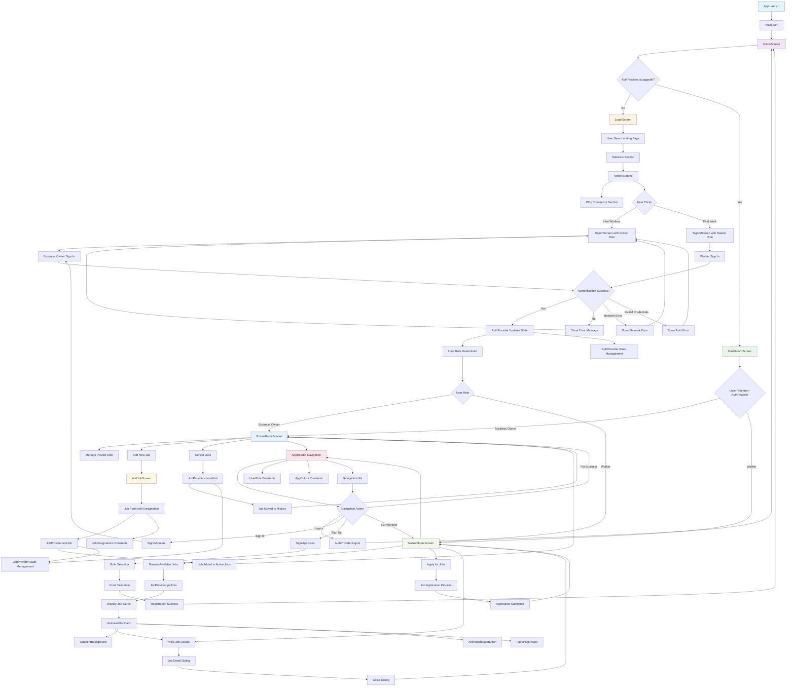
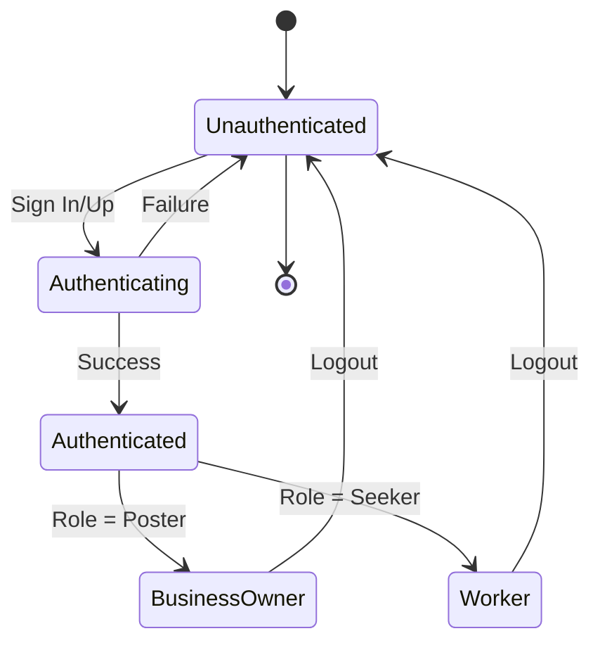
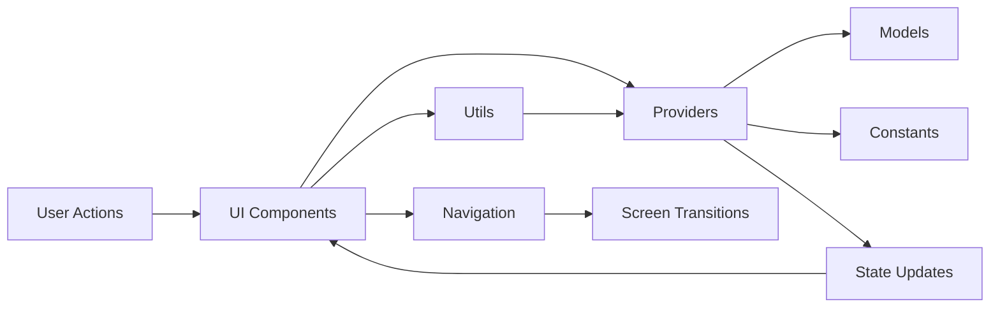
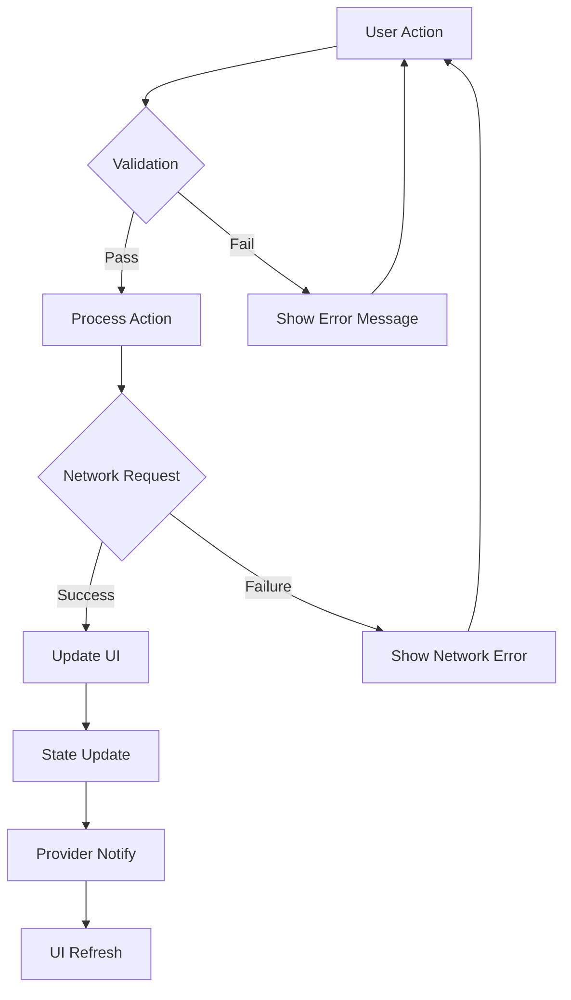

# WorkBee App Flow Chart Diagram

## Application Flow Overview



## Detailed Flow Breakdown

### 1. Application Startup Flow
```
App Launch → main.dart → HomeScreen → Check Authentication Status
```

### 2. Authentication Flow
```
Not Logged In → LoginScreen → User Actions → Sign In/Up → Role Selection → Dashboard
```

### 3. Business Owner Flow
```
Dashboard → PosterHomeScreen → Manage Jobs → Add/Cancel Jobs → Job Management
```

### 4. Worker Flow
```
Dashboard → SeekerHomeScreen → Browse Jobs → View Details → Apply for Jobs
```

### 5. Navigation Flow
```
AppHeader → Navigation Actions → Role-based Routing → Screen Transitions
```

## Key Components and Their Roles

### Screens (2,579 total lines)
- **LoginScreen (303 lines)**: Landing page with statistics and action buttons
- **SignInScreen (384 lines)**: Authentication with role selection
- **SignUpScreen (450 lines)**: Registration with dynamic forms
- **DashboardScreen (251 lines)**: Post-login hub with quick actions
- **PosterHomeScreen (109 lines)**: Business owner job management
- **SeekerHomeScreen (91 lines)**: Worker job browsing
- **AddJobScreen (205 lines)**: Job posting with designation selection

### Providers (65 lines)
- **AuthProvider (40 lines)**: Authentication state management
- **JobProvider (25 lines)**: Job data management

### Widgets (614 lines)
- **AppHeader (216 lines)**: Navigation and user interface
- **AnimatedJobCard (107 lines)**: Job display with animations
- **AnimatedScaleButton (83 lines)**: Interactive buttons
- **GradientBackground (31 lines)**: Reusable background component

### Models & Constants (76 lines)
- **Job Model (18 lines)**: Job data structure
- **AppColors (22 lines)**: Color constants
- **JobDesignations (15 lines)**: Predefined job types
- **UserRoles (0 lines)**: Role enumeration

### Utils (49 lines)
- **NavigationUtils (49 lines)**: Centralized navigation logic

## State Management Flow



## Data Flow Architecture



## Error Handling Flow



This flow chart represents the complete application architecture with 2,579 lines of code, showing how user interactions, state management, and navigation work together to create a seamless job portal experience. 