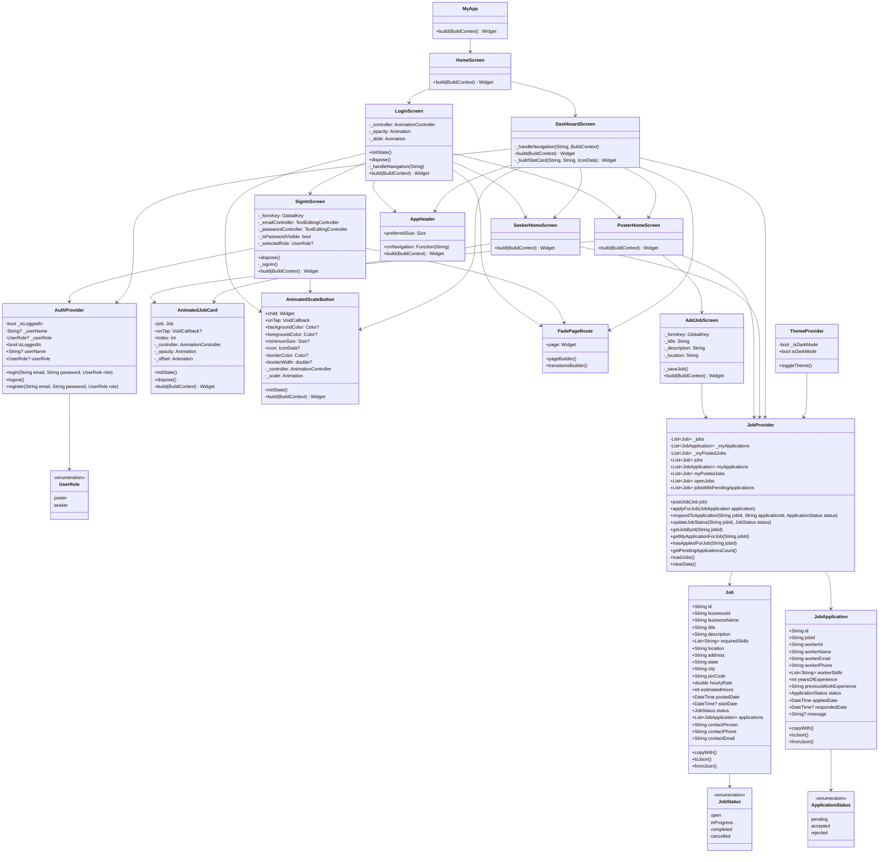
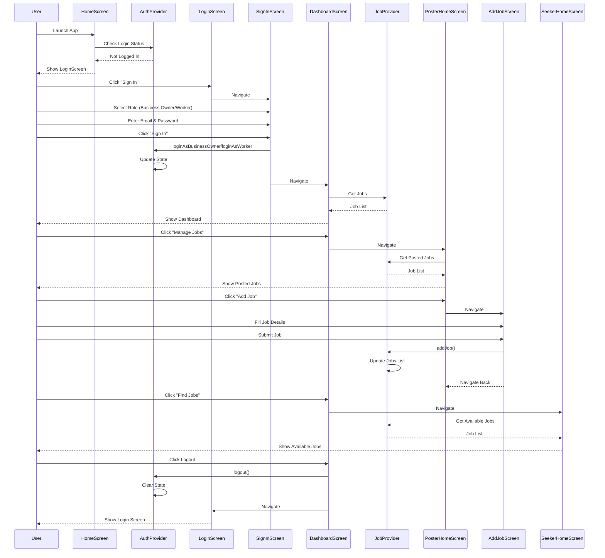
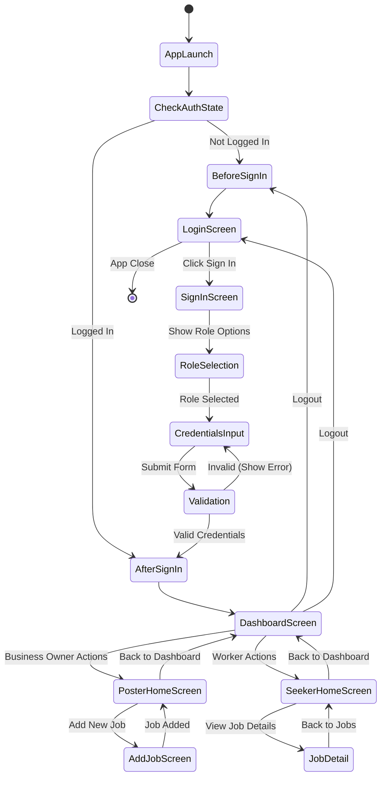
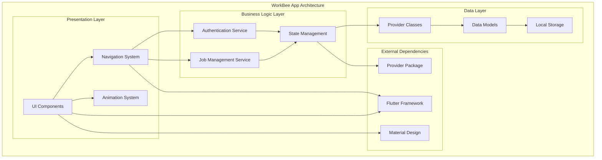
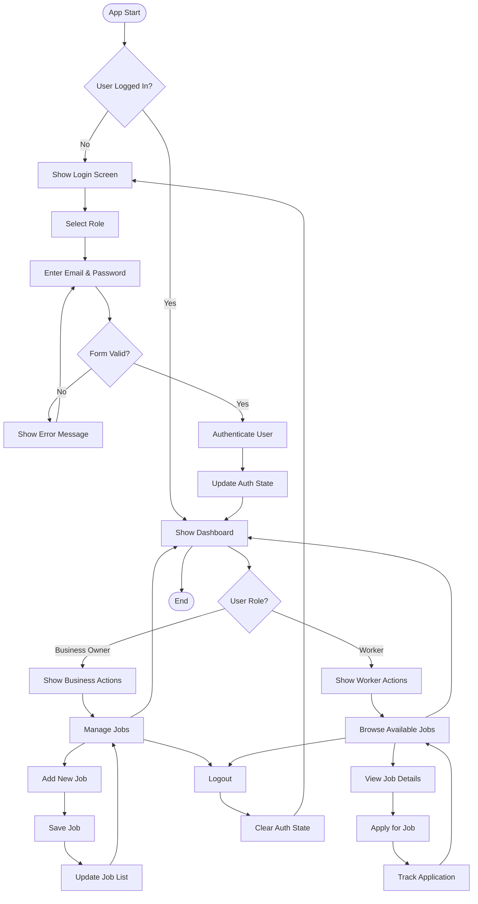

# WorkBee App - UML Diagrams Documentation

## Table of Contents
1. [Class Diagram](#class-diagram)
2. [Use Case Diagram](#use-case-diagram)
3. [Sequence Diagram](#sequence-diagram)
4. [State Diagram](#state-diagram)
5. [Component Diagram](#component-diagram)
6. [Activity Diagram](#activity-diagram)

---

## Class Diagram

---

## Use Case Diagram

```mermaid
graph TB
    subgraph "WorkBee App Use Cases"
        subgraph "Authentication"
            UC1[Sign In]
            UC2[Sign Out]
            UC3[Select Role]
        end
        
        subgraph "Business Owner"
            UC4[Post Job]
            UC5[Manage Jobs]
            UC6[View Job Applications]
            UC7[Edit Job Details]
        end
        
        subgraph "Worker"
            UC8[Browse Jobs]
            UC9[Apply for Job]
            UC10[View Job Details]
            UC11[Track Applications]
        end
        
        subgraph "General"
            UC12[View Dashboard]
            UC13[Navigate App]
            UC14[View Statistics]
        end
    end
    
    subgraph "Actors"
        A1[Business Owner]
        A2[Worker]
        A3[Guest User]
    end
    
    %% Business Owner Use Cases
    A1 --> UC1
    A1 --> UC2
    A1 --> UC3
    A1 --> UC4
    A1 --> UC5
    A1 --> UC6
    A1 --> UC7
    A1 --> UC12
    A1 --> UC13
    A1 --> UC14
    
    %% Worker Use Cases
    A2 --> UC1
    A2 --> UC2
    A2 --> UC3
    A2 --> UC8
    A2 --> UC9
    A2 --> UC10
    A2 --> UC11
    A2 --> UC12
    A2 --> UC13
    A2 --> UC14
    
    %% Guest User Use Cases
    A3 --> UC1
    A3 --> UC3
    A3 --> UC13
```

---

## Sequence Diagram

---

## State Diagram

---

## Component Diagram

---

## Activity Diagram

---

## Key Design Patterns Used

### 1. **Provider Pattern**
- `AuthProvider`: Manages authentication state
- `JobProvider`: Manages job data
- Centralized state management

### 2. **Observer Pattern**
- `ChangeNotifier` for state updates
- UI automatically rebuilds when state changes

### 3. **Factory Pattern**
- `FadePageRoute` for creating custom page transitions

### 4. **Strategy Pattern**
- Different navigation strategies for different user roles

### 5. **Component Pattern**
- Reusable widgets (`AnimatedJobCard`, `AnimatedScaleButton`, `AppHeader`)

---

## Architecture Principles

### ✅ **SOLID Principles**
- **Single Responsibility**: Each class has one purpose
- **Open/Closed**: Components are extensible without modification
- **Liskov Substitution**: Widgets properly extend base classes
- **Interface Segregation**: Focused, specific interfaces
- **Dependency Inversion**: Dependencies on abstractions, not concretions

### ✅ **Clean Architecture**
- **Separation of Concerns**: UI, Business Logic, Data layers separated
- **Dependency Direction**: Dependencies point inward
- **Testability**: Each layer can be tested independently

### ✅ **Flutter Best Practices**
- **Widget Composition**: Building complex UIs from simple widgets
- **State Management**: Using Provider for app-wide state
- **Navigation**: Custom page routes for smooth transitions
- **Responsive Design**: Adapts to different screen sizes

---

*This documentation provides a comprehensive overview of the WorkBee app's architecture, design patterns, and user flows.* 